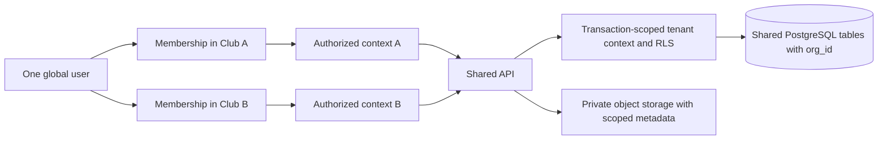
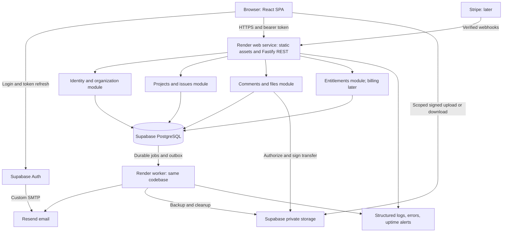
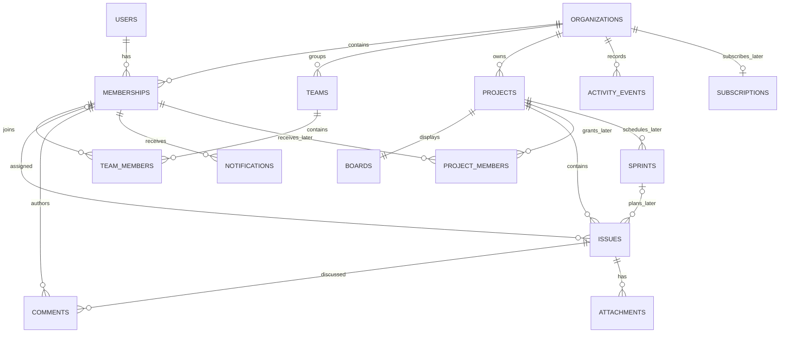
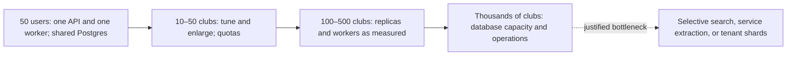
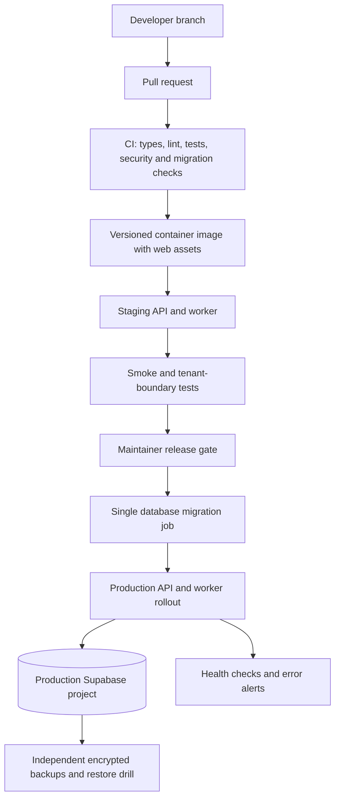

# Student Club Project Management SaaS

**Software architecture document · Version 1.0 · 5 September 2026**

**Status:** Proposed architecture for implementation and validation. No application has been built or benchmarked as part of this document.

**Accepted scope amendment · 5 September 2026:** The product is laptop/desktop first, per the user's implementation direction. Desktop browser usability and keyboard accessibility are the release targets. Mobile-specific layouts and validation are deferred. This amendment supersedes mobile-related requirements and phase exit criteria below; the remainder of the original architecture is preserved. Current implementation progress is tracked in [implementation status](implementation-status.md).

## Executive recommendation

Build a **multi-tenant modular monolith**: React and TypeScript in the browser; a TypeScript/Fastify REST API; PostgreSQL, authentication, and private object storage supplied by Supabase; one web service and one background worker on Render. Use PostgreSQL for search and durable background work. Start with polling. Add Stripe only after other clubs show willingness to pay.

The first usable product is a workspace with members, projects, a task list and Kanban board, assignments, comments, due dates, modest attachments, notifications, and reliable export. Deliver one useful student-specific workflow: a semester project template with a handoff checklist and manual archiving. Keep sprints, configurable workflows, private projects, and billing out of the initial release.

Plan for **US$40–80/month, approximately CA$56–112/month**, for a small production deployment, plus optional staging. This uses an explicit planning exchange rate of **US$1 = CA$1.40**, not a current exchange-rate quote. A practical allocation including staging is **CA$100–150/month**. Provider prices were checked for this document; allowances and costs must be rechecked before purchase.

This reduces cash infrastructure spending relative to the club's stated CA$9,000/year Jira estimate, but does not establish lower total cost. Expect roughly **500–850 engineering hours for the internal release**, plus ongoing maintenance. Building makes sense if the learning value and student-club product opportunity justify that effort. Before committing, revalidate the Jira configuration and ask vendors about applicable education/nonprofit programs; compare an existing tool against the actual MVP requirements. Treat the CA$9,000 figure as a user-provided baseline, not a verified quote.

### Scope language

- **NOW:** Required for a secure internal MVP or its release gate.
- **LATER:** A planned extension, implemented after validation. Do not create empty subsystems merely because they appear in this design.
- **DEMAND ONLY:** Build only when measurable usage or paying customers justify the maintenance burden.

### Planning assumptions

Four developers contribute around eight hours per week each, with uneven experience and exam-related interruptions. Users are primarily invited club members using modern browsers. An organization averages about 50 registered users, but users can belong to multiple organizations. Most projects are visible to the whole club. This is an operational collaboration tool, not a student information system or repository for sensitive recruitment evaluations, health information, payment-card details, or university records. The team is comfortable with TypeScript; existing team expertise should outweigh a minor framework preference.

## 1. Requirements and product boundaries

### Problems and users

| Problem | Product response | Primary user |
|---|---|---|
| Work scattered across chat, spreadsheets, and memory | One task with an owner, status, due date, and discussion | General members and project leads |
| Enterprise tooling is expensive and difficult to administer | Predictable organization pricing and a small feature set | Club executives and treasurers |
| Volunteers have limited time | Fast onboarding, useful defaults, mobile-friendly views | Occasional contributors |
| Responsibilities disappear when executives graduate | Handoff checklist, archived projects, durable ownership | Incoming/outgoing executives |
| Multiple committees operate within one club | Teams as organizational groups; projects as work containers | Committee leads |
| Students participate in several organizations | One identity with separate memberships and permissions | Multi-club members |

Start with university clubs and small volunteer organizations of approximately 10–150 members. Small commercial teams are a possible secondary market; avoid changing the roadmap to satisfy enterprise procurement before validating the club use case. University IT administrators and faculty advisers are stakeholders, not separate permission systems in the MVP.

### Functional requirements

The product must let an authorized user create or join an organization, switch organizations, manage membership where permitted, create projects, and track work through a small set of statuses. Members must be able to find their assignments, discuss issues, and inspect meaningful changes. Administrators must be able to remove access promptly, export organization data, archive completed work, and transfer ownership. External beta requires self-service data export/deletion requests, quotas, and tested tenant boundaries.

Success is a completed workflow: an executive invites a member; the member accepts, sees the correct workspace, creates or receives a task, updates it, and another member sees the change. Security and recovery are part of that workflow, not post-launch enhancements.

### Non-functional requirements and acceptance targets

These are engineering targets to validate, not provider guarantees or customer SLAs.

| Area | Internal MVP target | Paid beta/launch target |
|---|---|---|
| Isolation | No cross-organization reads or writes in automated adversarial tests | Same gate for API, jobs, exports, search, files, and new features |
| Responsiveness | p95 ordinary API response under 500 ms at 10 concurrent active users; board usable within 2 seconds on a reasonable connection | Load-test a measured peak plus 2× headroom; publish tested dataset size |
| Availability | Aim for 99.5% monthly; acknowledge single-instance outages | Aim for 99.9% after redundancy and operational coverage; no contractual SLA initially |
| Recovery | Database/object recovery point objective ≤24 hours; recovery time objective ≤8 hours | Fund and test ≤1-hour RPO and ≤4-hour RTO before promising them |
| Consistency | Task changes and activity/outbox records commit atomically | Same; notifications may arrive asynchronously |
| Accessibility | Keyboard task movement, labeled controls, adequate contrast, responsive layout | Audit core flows against WCAG 2.2 AA as a design target |
| Maintainability | One repository, documented modules, repeatable local setup and migrations | Two maintainers can deploy, restore, and rotate credentials |
| Portability | Organization export including structured data and attachment manifest | Tested export completeness and deletion workflow |
| Cost control | Per-organization upload/invite caps and monthly spending alerts | Metered usage, fair job scheduling, tenant-specific limits |

Do not claim 99.9% availability from a single API instance and a daily backup. A backup reduces data-loss exposure; it does not provide high availability.

### Deliberately excluded initially

No custom workflow engine, permission designer, Jira Query Language clone, epics/program portfolios, dependencies/Gantt charts, time tracking/payroll, collaborative document editor, native mobile apps, offline synchronization, marketplace, AI assistant, general automation builder, or custom university SAML integration. No public anonymous projects, issue-level confidentiality, or sensitive applicant files. No Kubernetes, Kafka, microservices, or database sharding.

## 2. Core feature scope

| Feature | Timing | Minimum behavior and reason |
|---|---|---|
| Organizations/workspaces | NOW | Stable tenant ID, name, slug, timezone, membership; avoids a costly tenancy retrofit |
| Multi-organization accounts | NOW | Explicit workspace switcher; permissions evaluated separately |
| Teams | NOW, minimal | Named member groups, optional project owner team; grouping only, no implicit access grants |
| Projects | NOW | Name/key, description, lead, active/archive state; organization-visible |
| Issues/tasks | NOW | Title, Markdown description, fixed type task/bug, status, owner, creator, timestamps |
| Kanban boards | NOW | One board per project; To do, In progress, Done; keyboard alternative to drag-and-drop |
| Backlog | NOW, minimal | Ordered unplanned issue list; an explicit planning state distinguishes backlog from committed board work |
| Sprints | LATER | Only if pilot clubs work in iterations; start/complete sprint and carry over unfinished work |
| Assignment | NOW | One active organization member per issue; unassigned allowed |
| Priority | NOW | Low, Normal, High, Urgent; no configurable schemes |
| Labels | NOW | Organization labels and issue-label joins; no hierarchy |
| Due dates | NOW | Calendar date interpreted in organization timezone; no scheduling engine |
| Comments | NOW | Sanitized Markdown, edit marker, edit/delete own comment; no rich collaborative editor |
| Attachments | NOW, bounded | Private downloads, 10 MB/file initially, 1 GB/organization; safe types only |
| Notifications | NOW | In-app assignment notifications; invite/recovery email; opt-in assignment email |
| Activity history | NOW | Changes to owner, status, title, due date, permissions; concise structured events |
| Roles/permissions | NOW | Owner, Admin, Member; project lead delegates project administration |
| Project templates | NOW, minimal | Two maintained templates bundled with the application; no template editor |
| Basic dashboard | NOW | My tasks, overdue work, counts by status; permissions applied before aggregation |
| Search/filtering | NOW | Issue key/title/text, status, project, assignee, priority, label, due date; bounded results |
| Saved filters, mentions, digests | LATER | Add when repeated user behavior establishes value |
| Private projects and viewers | LATER, before confidential use | Explicit project grants and audited visibility changes; never approximate with hidden UI |
| Advanced reporting and custom workflows | DEMAND ONLY | Maintenance grows quickly; require specific paying demand |

An MVP issue has one source of truth. Lists, backlogs, and boards are views over issues; dragging a card updates the issue, not a separate board copy. `planning_state = backlog | planned` is independent of `status = todo | in_progress | done`; completing an issue places it in planned work. This keeps backlog behavior explicit without requiring sprints.

## 3. Multi-tenant architecture

### Tenant identity and membership

An `organization` is the tenant and eventual billing customer. A Supabase platform project is an infrastructure environment shared by many application organizations; it is **not** one club. A person has one global application user tied to an authentication subject, and a separate membership for each organization. Role, join date, and membership status live on that relationship. Email domain is not a tenant key.

URLs use `/o/{organizationSlug}` for navigation and immutable UUIDs in API routes. A slug or client-selected organization is a locator, never proof of access. Invitations create memberships only after the intended verified email accepts a single-use, expiring invitation.

| Database model | Benefits | Costs | Decision |
|---|---|---|---|
| Shared database, shared tables with `org_id` | Lowest fixed cost, one migration, easy pooling | Requires rigorous isolation; noisy-neighbor risk | **NOW and default long term** |
| Shared database, schema per tenant | Some namespace separation | Many migrations/search paths; same failure domain; awkward pooling | Reject for normal clubs |
| Database per tenant | Strong operational separation, tenant restore/custom region | High fixed cost and provisioning/upgrade burden | DEMAND ONLY for sufficiently valuable customers |

### Isolation layers

1. **API:** Validate identity, derive user ID from the token, verify active membership, and apply action/project permission. Never trust a submitted `org_id`, role, author, or billing entitlement.
2. **Repositories:** Require a server-created tenant context. Every scoped lookup includes organization ID; bulk operations validate all referenced IDs.
3. **Database:** Required `org_id`, composite foreign keys, and PostgreSQL row-level security (RLS). Application roles have no ownership or `BYPASSRLS` privileges. Enable and force RLS on tenant tables.
4. **Other systems:** Scope file metadata, jobs, notifications, metrics access, exports, caches, and later search indexes. Object-key prefixes and cache-key prefixes assist organization; they are not authorization.

PostgreSQL table owners normally bypass RLS, and superusers/`BYPASSRLS` roles bypass it. A runtime connection using a migration owner or broadly privileged Supabase key would defeat this layer. Provision separate migration, API, worker, and storage credentials. [PostgreSQL row-security documentation](https://www.postgresql.org/docs/current/ddl-rowsecurity.html).



### Request-scoped database access

Use a transaction on one checked-out connection. Set `app.org_id` and `app.user_id` using parameterized `set_config(..., true)`, then execute all domain queries through that transaction. The final `true` makes settings transaction-local, preventing connection-pool leakage after commit/rollback. Do not set tenant state on a global pool or a separate connection.

An illustrative baseline policy for a tenant table is:

```sql
ALTER TABLE app.issues ENABLE ROW LEVEL SECURITY;
ALTER TABLE app.issues FORCE ROW LEVEL SECURITY;

CREATE POLICY issue_tenant_scope ON app.issues
FOR ALL TO app_api
USING (
  org_id = nullif(current_setting('app.org_id', true), '')::uuid
)
WITH CHECK (
  org_id = nullif(current_setting('app.org_id', true), '')::uuid
);
```

This is a **tenant-boundary policy, not the complete permission implementation**. Missing context denies access. The API establishes membership first and checks project/action permission; the SQL role can set context, so RLS does not protect against a fully compromised API. Use parameterized SQL and forbid user-controlled SQL, filters, and arbitrary context values. Future private-project checks must be applied consistently to detail, list, aggregate, and export queries.

Membership bootstrap needs a narrow exception: the API may read the current user's memberships via a reviewed function that accepts no client-supplied identity beyond the validated server context. It returns only that user's organizations; it cannot write memberships. Any security-definer function has a fixed safe search path, revoked public execution, and a narrowly privileged owner. Organization creation is a bounded transaction that creates the tenant and first owner together.

Keep app tables in a schema not exposed through Supabase's public Data API, and revoke `anon`/`authenticated` direct table privileges. The browser uses Supabase Auth, but all domain data goes through Fastify. This prevents an alternate authorization path.

### Growth

Keep a stable tenant UUID, no global cross-tenant issue relationships, and organization-complete export from the start. Add tenant quotas and query visibility before adding database infrastructure. If a shared database eventually exhausts tested capacity, introduce a tenant-to-database routing directory and migrate selected tenants with a write freeze, verified copy, routing switch, and rollback plan. A large number of registered users alone is not a sharding trigger.

## 4. System architecture



### Why a modular monolith

One repository and release artifact contain explicit modules for identity/membership, projects/issues, collaboration/files, notifications/jobs, and later billing. The API and worker use different entrypoints from the same image. They are separate processes for deployment and reliability, **not independently owned microservices**.

Each module owns its writes and exposes service functions. Cross-module work uses those functions and the same transaction where atomicity matters. Shared infrastructure provides logging, database connections, authorization context, and provider adapters. Avoid a large generic repository framework or abstractions for hypothetical providers.

Suggested repository layout: `apps/web`, `apps/server`, `packages/contracts`, `db/migrations`, and `docs/runbooks`. Within the server, use feature modules rather than folders containing hundreds of unrelated controllers/models. Generate frontend API types from OpenAPI; do not expose database types as API contracts.

### Component responsibilities

| Component | NOW | LATER / trigger |
|---|---|---|
| Frontend | React, Vite, TypeScript, routing, query cache, accessible components | CDN-hosted assets if web bandwidth becomes material |
| API | Fastify routes → authorization → module service → transactional SQL | Horizontal web replicas when tested capacity or availability requires |
| Database | PostgreSQL source of truth, constraints, RLS, indexes | Larger compute, replicas for stale-tolerant reporting, selective partitioning |
| Auth | Managed Supabase Auth; local memberships remain authoritative | Microsoft/Google OAuth after pilot requests, organizational SSO only on demand |
| Files | Private object storage immediately; metadata in SQL | R2 or another store if cost/residency requirements justify migration |
| Jobs | PostgreSQL durable outbox/job table, one worker | More workers first; dedicated broker only after contention/throughput evidence |
| Notifications | In-app rows and bounded transactional emails | Digests, mentions, preferences; no chat-service replacement |
| Search | PostgreSQL full-text/key search with tenant filters | Dedicated engine when measured relevance/latency demands it |
| Caching | Browser query cache, static asset cache; no shared response cache | Redis for distributed counters, proven hot reads, or socket fanout |
| Observability | JSON logs, error tracking, uptime and backup/job alerts | Traces and aggregate metrics as diagnosis requires |
| Integrations | Auth, email, file provider | Stripe, CSV import, calendar/Discord/GitHub as validated |

PostgreSQL provides full-text vectors, relevance operations, and indexes. Use it for issue title/description search before adopting a separate index and its synchronization burden. [PostgreSQL full-text search](https://www.postgresql.org/docs/current/textsearch-intro.html).

### Background work and failures

In the issue transaction, write the issue change, activity event, and outbox job. A worker claims ready jobs with `FOR UPDATE SKIP LOCKED`, writes a lease and attempt count, commits the claim, then performs network work outside that transaction. Completion updates the job using its lease token. Expired leases are retried with backoff/jitter; repeated failures enter a visible dead-letter state.

Delivery is at least once. Deduplicate notification rows with `(event_id, recipient_id, channel)` and supply a provider idempotency key where supported. A crash after an email is accepted but before job acknowledgment can still cause duplicates outside a provider's deduplication window; do not promise exactly-once email. Jobs carry `org_id`, action type, and entity IDs; load current data through the tenant context. Recheck recipient membership and project access before notification/export delivery.

The worker's global job-claim role can inspect scheduling metadata across tenants, but receives no general domain-table bypass. Job payloads contain IDs rather than comment bodies. A tenant-scoped worker role handles domain operations. Treat the scheduler as privileged infrastructure and prohibit public job creation with arbitrary types or payloads.

PostgreSQL jobs need lease expiry, deduplication, retry limits, and tests, even at 50 users. A compatible maintained PostgreSQL job library is acceptable after a short transaction/RLS spike; otherwise this narrowly scoped outbox is manageable. Do not run fire-and-forget promises inside request handlers. Render supports a continuously running background-worker process. [Render background workers](https://render.com/docs/background-workers).

## 5. Technology choices and alternatives

Recommendations below are design judgments based on this team's assumed constraints, not universal performance rankings. Pin supported stable versions and lockfiles during implementation; do not start on framework or database prereleases.

| Layer | Recommended | Reasonable alternatives | Decision rationale |
|---|---|---|---|
| Frontend | React + Vite + TypeScript | Next.js; Vue; SvelteKit | Authenticated application does not need SEO/server rendering; Vite keeps runtime ownership straightforward. Choose another framework if the team already knows it well. |
| UI/data access | Accessible component primitives, Tailwind, TanStack Query | Existing design system; plain CSS; framework-native fetching | Reuse forms/dialogs; implement optimistic task changes with rollback and cache invalidation. |
| Backend | Fastify + TypeScript | NestJS; Django + DRF; Rails | One language and a small deployment. Nest adds conventions at the cost of scaffolding; Django/Rails are strong if existing expertise reduces effort. |
| SQL access | `pg` + Kysely, SQL migrations | Drizzle; Prisma; direct parameterized SQL | Keep composite keys, RLS, and transaction connection ownership explicit. An ORM must not hide tenant context. |
| Database | Managed PostgreSQL | MySQL; MongoDB; SQLite | Relational memberships/permissions fit SQL; RLS adds a useful boundary. SQLite suits some local tools, but adds deployment constraints for replicated writers. |
| Authentication | Supabase Auth | Clerk/Auth0; managed OAuth plus an auth library; self-hosted Keycloak | Consolidates providers and avoids owning passwords. Separate auth products can improve UX, but introduce pricing/integration choices. Keycloak adds operations. |
| Hosting | Render web + worker | Railway; Fly.io; AWS/GCP/Azure; a VPS | Easy process deployment and managed ingress; hyperscalers add configuration, a VPS adds patching/backups. Credits must not be the sole basis for selection. |
| Object storage | Supabase Storage | Cloudflare R2; Amazon S3 | Already in the backend provider; migrate only if transfer cost, policy, or scale justifies it. |
| Live updates | Focus-aware polling | SSE; WebSockets; Supabase Realtime | No presence or collaborative editing need. Poll active board at 30–60 seconds with jitter; refetch on focus and after mutations. |
| Email | Resend with custom domain/SMTP | Postmark; Amazon SES | Small integration and predictable low-volume behavior; SES merits review at high volume. |
| CI/CD | GitHub Actions + Render deployment | GitLab CI; provider-only pipelines | PR checks, tested immutable image, explicit production release. |
| Monitoring | Pino JSON logs + Sentry + external uptime check | OpenTelemetry collector; hosted metrics suite | Start with actionable errors/alerts. Avoid maintaining an observability cluster. |
| Billing | Stripe Checkout/Billing/Customer Portal, later | Paddle or other merchant-of-record service | Hosted payment UI; a merchant-of-record changes tax responsibility, price, and contractual model and needs separate evaluation. |

Fastify supports schema-based request validation and response serialization; response schemas help prevent accidental field exposure. The team must still implement authorization and safe business constraints. [Fastify validation and serialization](https://fastify.dev/docs/latest/Reference/Validation-and-Serialization/). Framework context: [Vite guide](https://vite.dev/guide/), [Next.js documentation](https://nextjs.org/docs), [NestJS documentation](https://docs.nestjs.com/).

## 6. Database architecture

### Design conventions

Use UUID primary identifiers and `timestamptz` for event timestamps; `due_date` is a SQL `date`. Every tenant-owned table carries `org_id NOT NULL`, even when derivable through a project. Add `UNIQUE(org_id, id)` wherever a composite foreign key references that pair. Project-specific children also carry `project_id` and use a unique parent triple where needed. This intentional duplication enforces tenant/project consistency at the database boundary.

Global tables are limited to users, auth-session revocation metadata, and later plan definitions/provider webhook receipts. No tenant IDs belong in a global user role field. Do not store passwords or card numbers in application tables.

### Core tables — create NOW

| Table | Important columns | Relationships / constraints |
|---|---|---|
| `users` | `id`, `auth_subject UNIQUE`, display name, `disabled_at`, `sessions_revoked_before`, timestamps | Global application profile. Auth provider is identity/email-verification authority; email mirror is not an identity key. |
| `organizations` | `id`, `slug UNIQUE`, name, timezone, lifecycle state, timestamps | Root tenant; plan entitlement defaults supplied by code initially |
| `memberships` | `id`, `org_id`, `user_id`, role, state, joined/left timestamps | `UNIQUE(org_id,user_id)`; roles Owner/Admin/Member; membership preserved inactive for history |
| `invitations` | `id`, `org_id`, email, token hash, intended role, expiry, accepted/revoked timestamps, inviter membership | One-use token; acceptance requires matching verified address; restrict assignable roles |
| `teams` | `id`, `org_id`, name, archived timestamp | Unique normalized team name per organization |
| `team_members` | `org_id`, team ID, membership ID | Composite primary key; both referenced records in same organization |
| `projects` | `id`, `org_id`, key, name, description, lead membership, optional team ID, `term_label`, archived timestamp, `next_issue_number` | Unique `(org_id,key)`; key immutable in MVP; optional term is a label, not a full academic calendar |
| `boards` | `id`, `org_id`, `project_id`, name | `UNIQUE(org_id,project_id)` for one board/project; fixed columns derive from issue status |
| `issues` | `id`, `org_id`, `project_id`, number, title, Markdown description, type, status, planning state, priority, assignee membership, creator membership, due date, rank, version, timestamps | Unique `(org_id,project_id,number)`; same-tenant/project constraints; assignee may be null |
| `labels` | `id`, `org_id`, name, color | Unique normalized label name per organization |
| `issue_labels` | `org_id`, issue ID, label ID | Unique `(org_id,issue_id,label_id)`; same-tenant composite foreign keys |
| `comments` | `id`, `org_id`, `project_id`, issue ID, author membership, body, version, edited/deleted timestamps | Composite issue FK includes project; soft deletion hides body immediately |
| `attachments` | `id`, `org_id`, `project_id`, issue ID, uploader membership, bucket, object key, original name, media type, bytes, checksum, state, reservation expiry | Object key unique; state pending/quarantined/ready/deleting; issue-only attachments initially |
| `notifications` | `id`, `org_id`, recipient membership, event ID, issue/project reference, type, read timestamp, created timestamp | Unique event/recipient/channel semantics; recipient-only reads/updates |
| `activity_events` | `id`, `org_id`, optional project/issue IDs, actor membership or system actor, action, selected before/after fields, time | Application-append-only; store structured changes, not full content snapshots |
| `outbox_jobs` | `id`, `org_id`, event/type, minimal JSON payload, idempotency key, run time, lease token/until, attempts, state, last error | Unique idempotency key; global scheduler can claim metadata only |
| `usage_counters` | `org_id`, metric, period, used/reserved amount | Atomic upload reservations and quotas; reconcile against source records |
| `idempotency_records` | `org_id`, user ID, operation, key, request hash, result reference/response, expiry | Unique tenant/user/operation/key; committed with the mutation; short retention |
| `revoked_sessions` | auth session ID, user ID, expires timestamp | Global API denylist for app-mediated logout; no tokens stored |

Use role strings with CHECK constraints and a reviewed permission map in code. Do not create a generic permissions editor or dozens of role tables. Local setup/fixtures should seed roles only as values. Enforce at least one active owner by locking the organization row while transferring/removing owner membership; a simple per-row CHECK cannot enforce a cross-row invariant.

### Later schema — document now, migrate when used

| Table / change | Purpose |
|---|---|
| `project_members` plus project visibility | Explicit viewer/contributor/manager grants for private projects; membership must remain active |
| `sprints` | Tenant/project, name, start/end dates, planned/active/completed state; date checks and one active sprint per project |
| Nullable `issues.sprint_id` and `sprint_issue_history` | Current iteration plus participation/status snapshots for completed-sprint reporting |
| `project_templates` / versions | User-editable templates only after bundled templates prove useful |
| `academic_terms` | Configurable date ranges if labels become insufficient; no universal semester assumption |
| `subscriptions` | Tenant, provider customer/subscription IDs, price, status, period end, cancellation state |
| `plans`, `plan_entitlements`, `org_entitlement_overrides` | Server-enforced features and limits; versioned price/plan mapping |
| `billing_webhook_events` | Global unique provider event ID, processing state, received time; restricted to billing handlers |
| `notification_preferences` | Per-membership/channel settings once more notification types exist |
| `export_requests`, `deletion_requests` | Auditable async lifecycle state as self-service management is introduced |

### ER diagram

`SPRINTS`, `PROJECT_MEMBERS`, and `SUBSCRIPTIONS` are future entities. To keep the diagram readable, it omits timestamps, invitations, labels, jobs, and repeated tenant foreign keys; the table definitions above remain authoritative.



### Integrity, concurrency, and indexes

- An issue's `(org_id,project_id)` references its project. A comment's `(org_id,project_id,issue_id)` references an issue's unique triple. Assignee references `(org_id,membership_id)`. Future sprint links use `(org_id,project_id,sprint_id)`. A valid UUID from another tenant or project must fail at the database layer.
- Issue numbers come from an atomic update to the project's counter, in the create-issue transaction. Do not use `MAX(number)+1`. Issue keys such as `EVENT-42` are human-readable within the organization; URLs still include the organization.
- Issue updates require a version/ETag. Update with `WHERE version = expected_version`; return `412 Precondition Failed` if another edit won. Optimistic board moves roll back/refetch on conflict. Use numeric rank gaps and lock the affected project during MVP reordering; rebalance ranks within that lock when needed.
- Index membership by `(user_id,state)` and `(org_id,state)`. Index issues by `(org_id,project_id,planning_state,status,rank,id)`, `(org_id,assignee_membership_id,status,due_date)`, and `(org_id,updated_at,id)`. Index comments by `(org_id,issue_id,created_at,id)` and unread notifications by `(org_id,recipient_membership_id,created_at)` with a partial unread predicate.
- Add a GIN index over an issue search vector and B-tree tenant/project filters; validate actual plans with `EXPLAIN ANALYZE`. PostgreSQL can combine indexes; a tenant prefix in a SQL WHERE clause alone does not guarantee an efficient plan.
- Bound list/board responses. Return column counts plus the first page per column; never download an organization's entire backlog to render a board.
- Archive projects as read-only; preserve membership history. On member removal, revoke access and unassign open issues in a transaction or explicitly mark reassignment needed. Do not cascade-delete authored comments when a membership becomes inactive.
- Allow constrained JSONB for activity payloads or later template content. Core relationships, statuses, and authorization remain typed SQL columns. Apply deletion/retention consistently to search vectors and event payloads.

## 7. API architecture and data flow

Use JSON REST under `/api/v1`. Generate an OpenAPI specification from reviewed request/response contracts. Keep tenant resources under `/orgs/{orgId}`; `/me` is the authenticated global identity scope. Version breaking changes; additive optional fields normally do not require a new API version. No public API tokens or third-party write API in the MVP.

### Endpoint examples

In this table, `{o}`, `{p}`, and `{i}` mean organization, project, and issue UUIDs. Organization endpoints are all under `/api/v1`.

| Area | Endpoint | Authorization / behavior |
|---|---|---|
| Signup/login | Supabase `/auth/v1/signup`, `/auth/v1/token?grant_type=password` through its SDK | Provider handles credentials and verification; use SDK rather than hand-rolling provider protocol |
| Password reset | Supabase `/auth/v1/recover` through SDK | Generic response, configured safe redirect URLs |
| OAuth, later | Provider authorization/PKCE callback | State/code-verifier validation; application callback completes SDK flow |
| Logout | `POST /api/v1/auth/logout` | Validate token, denylist its session ID, revoke provider session, clear local SDK state |
| Current user | `GET /me`, `PATCH /me` | Own profile only; editable field allowlist |
| Organizations | `GET /me/organizations`, `POST /orgs` | Own memberships; verified account and creation quota |
| Organization settings | `GET /orgs/{o}`, `PATCH /orgs/{o}` | Active member read; Owner/Admin write |
| Membership | `GET /orgs/{o}/members`, `PATCH /orgs/{o}/members/{m}`, `DELETE /orgs/{o}/members/{m}` | Admin management except protected owner actions; removal is deactivation |
| Invitations | `POST /orgs/{o}/invitations`, `POST /invitations/accept` | Admin sends; acceptance validates hashed single-use token and verified recipient |
| Teams | `GET/POST /orgs/{o}/teams`, `PUT/DELETE /orgs/{o}/teams/{t}/members/{m}` | Read by member; manage by Admin |
| Projects | `GET/POST /orgs/{o}/projects`, `GET/PATCH /orgs/{o}/projects/{p}` | Member read; Admin creates; Admin/project lead edits |
| Archive | `POST /orgs/{o}/projects/{p}/archive` | Admin/lead; explicit unarchive operation; preserve data |
| Issues | `GET/POST /orgs/{o}/projects/{p}/issues` | Authorized project contributors |
| Issue detail/edit | `GET/PATCH /orgs/{o}/issues/{i}` | Resolve project under tenant; mutation requires `If-Match` |
| Issue movement | `POST /orgs/{o}/issues/{i}/move` | Body includes target status/planning state, neighboring issue IDs, expected version; server computes rank |
| Boards/backlog | `GET /orgs/{o}/projects/{p}/board`, `GET /orgs/{o}/projects/{p}/backlog` | Filtered/paginated view of issues |
| Sprints, later | `GET/POST /orgs/{o}/projects/{p}/sprints`, `POST /orgs/{o}/sprints/{s}/start`, `POST /orgs/{o}/sprints/{s}/complete` | Project manager; state-machine and same-project checks |
| Comments | `GET/POST /orgs/{o}/issues/{i}/comments`, `PATCH/DELETE /orgs/{o}/comments/{c}` | Authorized contributor; own edits, admin moderation with activity event |
| Attachments | `POST /orgs/{o}/issues/{i}/attachments`, `POST /orgs/{o}/attachments/{a}/complete`, `POST /orgs/{o}/attachments/{a}/download` | Quota reservation, actual-object verification, then fresh authorization for signed download |
| Notifications | `GET /orgs/{o}/notifications`, `PATCH /orgs/{o}/notifications/{n}` | Recipient membership must equal caller's membership; `read_at` only |
| Search/dashboard | `GET /orgs/{o}/search`, `GET /orgs/{o}/dashboard` | Authorization predicate applies before results, counts, and snippets |
| Export | `POST /orgs/{o}/exports` | Owner/Admin; async job; reauthorize download |
| Billing, later | `POST /orgs/{o}/billing/checkout`, `POST /orgs/{o}/billing/portal` | Owner only; server-controlled price mapping and return URLs |
| Provider webhook, later | `POST /api/v1/webhooks/stripe` | Provider signature, not user authentication; resolve tenant from stored customer mapping |

Example issue creation:

```http
POST /api/v1/orgs/{orgId}/projects/{projectId}/issues
Authorization: Bearer <access-token>
Content-Type: application/json
Idempotency-Key: <client-generated-uuid>

{
  "title": "Book venue for welcome night",
  "description": "Confirm capacity and accessibility.",
  "priority": "high",
  "assigneeMembershipId": "<membership-uuid>",
  "dueDate": "2026-09-18",
  "planningState": "planned"
}
```

Return `201 Created`, a scoped Location, `{id, key, version, ...}`, and `ETag: "1"`. The API supplies organization, project, creator, timestamps, and initial status. An assignee must be an active member with access to the project. Reject unknown/protected fields rather than mass-assigning a payload into an ORM.

### Shared API rules

- Cursor pagination defaults to 50, maximum 100, using a stable sort plus ID tie-breaker. Cursors are opaque locators, not authorization credentials. Allowlist sort/filter fields and bound query length/date ranges.
- Use consistent problem responses with a code, safe message, field errors where appropriate, and request ID. `401` means unauthenticated; `403` means a known accessible resource with a forbidden action; `404` masks inaccessible tenant/object existence; `409` is a business-state conflict; `412` is a stale version; `429` includes Retry-After.
- Idempotency records for creates are scoped to user, organization, and operation, store a request hash, and expire after a documented window such as 24 hours. Reusing a key with a different body returns conflict. Persist the record and result in the business transaction.
- `PATCH` cannot silently change an issue's tenant or project. Cross-project moves, if later supported, are explicit operations that revalidate all relationships and numbering.
- Restrict request size, batch length, outbound timeouts, query runtime, and work per request. Exports run asynchronously. Do not expose raw SQL, unrestricted regular expressions, or arbitrary provider URLs.
- API responses carrying private data use `Cache-Control: no-store` initially. Frontend query keys include organization and project IDs; clear cached organization data on logout/removal/switch as appropriate.

### Issue update request flow

```mermaid
sequenceDiagram
  participant UI as Browser
  participant API as Fastify
  participant DB as PostgreSQL
  participant WK as Worker
  participant EM as Email provider
  UI->>API: PATCH issue with bearer token and If-Match
  API->>API: Validate JWT and request schema
  API->>DB: Read own membership and account/session status
  API->>DB: Begin transaction and set local user/tenant context
  API->>DB: Lock/check membership and project permission
  API->>DB: Versioned update + activity + outbox
  DB-->>API: Commit
  API-->>UI: Updated issue and ETag
  WK->>DB: Claim outbox job with lease
  WK->>DB: Recheck recipient access; insert deduplicated notification
  WK->>EM: Send bounded email with idempotency key
  WK->>DB: Mark delivery/job complete
```

Membership-changing operations and sensitive domain writes use compatible row-lock ordering to serialize revocation against new writes. Requests committed before removal remain valid history; after removal commits, new authorization checks deny access. Reads already in flight and issued download links have explicitly bounded residual exposure.

## 8. Authentication and authorization

### Authentication lifecycle

**NOW:** Supabase Auth manages signup, email verification, password login, and password reset. The application stores a global profile keyed to the immutable provider subject. Configure custom SMTP for real member invitations and authentication email; the provider's default email service is unsuitable as a general production mail solution. [Supabase custom SMTP guidance](https://supabase.com/docs/guides/auth/auth-smtp).

Require a verified email before organization creation or invitation acceptance. University-domain verification can provide an optional badge or eligibility check, but does not prove executive authority or grant membership. Support non-university addresses for advisers and alumni. Do not automatically enroll everyone with the same university domain, and do not lock users out when a student address expires. Allow secure email change/recovery using provider flows and audited owner recovery procedures.

Use provider-supported password protections, long-password/passphrase support, generic recovery responses, throttling, and single-use reset links. Never implement password hashing, reset-token generation, or credential tables locally. Offer TOTP MFA to administrators during beta and require it for platform operators before external users.

**LATER:** Add Google/Microsoft login if pilot demand warrants it. Use PKCE and provider SDK state handling, exact allowed callback URLs, and server-side verification of resulting identity. Link accounts only through an authenticated, provider-supported process; an unverified matching email must not merge identities or memberships. Defer per-university SAML/SCIM until procurement demand funds it.

### Session strategy and explicit tradeoff

The initial SPA uses the Supabase browser SDK and sends access tokens in the Authorization header to Fastify. Use the SDK's supported refresh mechanism and persistent browser storage for usability; tokens in JavaScript-readable storage are exposed by XSS. Compensate with strict CSP, no arbitrary HTML rendering, sanitized Markdown, few third-party scripts, and dependency review. Do not claim these are HttpOnly cookies: they are not.

Fastify validates signature against the expected issuer's trusted JWKS, allowed algorithm, audience, issuer, expiration, and subject. Do not merely decode a JWT or trust an unverified user object. Configure a bounded access-token lifetime, initially 30 minutes. Cache public keys with rotation support; unknown keys trigger a controlled refresh. Refresh calls must not cause a login storm across tabs.

Every API request also checks the application account's disabled state, current membership where applicable, and application session denylist. App-mediated logout records the current `session_id` until all its possible access tokens expire, revokes the provider session, and clears local SDK state. Logout-all performs provider global sign-out, then records a user revocation cutoff and rejects tokens issued at or before it; retry provider failures and test concurrent refresh/sign-out behavior. Membership removal takes effect through database authorization even if the JWT remains valid. Provider-side logout outside this app may leave a signed access token usable until expiry; sensitive account/ownership actions additionally validate provider session status. Supabase documents both token refresh and the residual validity of signed access tokens after logout. [Supabase sessions](https://supabase.com/docs/guides/auth/sessions), [sign-out behavior](https://supabase.com/docs/reference/javascript/auth-signout).

If stronger session requirements emerge, introduce a backend-for-frontend with opaque Secure/HttpOnly/SameSite cookies and server-held provider tokens. This changes refresh, CSRF, and session storage responsibilities; it is a deliberate future migration, not an assumption hidden in the MVP design. Current bearer-token domain endpoints do not rely on ambient cookies; future cookie-authenticated mutations need CSRF protection. OAuth callbacks still need state validation now.

### Permission model

| Action | Owner | Admin | Project lead | Member |
|---|---|---|---|---|
| View organization-visible projects, tasks, dashboard | Yes | Yes | Yes | Yes |
| Create/update issues and add comments | Yes | Yes | Yes | Yes |
| Edit another user's comment body | No; may moderate/delete | No; may moderate/delete | No | No |
| Create projects / manage teams | Yes | Yes | No | No |
| Edit/archive a project | Yes | Yes | Own led project | No |
| Invite/remove ordinary members | Yes | Yes | No | No |
| Appoint/remove Admins | Yes | No | No | No |
| Transfer/add ownership, delete organization, manage billing | Yes | No | No | No |
| Export whole organization | Yes | Yes | No | No |

A project lead is an active membership referenced by a project, not a fourth organization-wide role. All MVP projects are visible to active members; the UI states this plainly. Admins cannot promote themselves or remove the last owner. Require recent reauthentication for ownership transfer, billing changes, and deletion.

Later, private projects use explicit `project_members` grants: viewer, contributor, manager. Organization Owner/Admin retain administrative visibility, clearly disclosed. Ordinary membership no longer implies access to a private project. Team membership remains grouping until the team-grant semantics are intentionally designed. Do not implement both direct grants and implicit team grants at once.

Permission checks run in a central policy module called by all module services, including worker/export paths. UI controls reflect policy but do not enforce it. Public API keys and personal tokens, if later added, require scoped permissions, hashed storage, expiration, rotation, revocation, and audit events.

## 9. Scalability and infrastructure triggers

User count is a planning dimension. Actual changes depend on concurrent sessions, request rate, dataset size, slow queries, background-job delay, availability needs, and measured cost per organization. There is no architectural requirement to introduce microservices at any particular headcount.

| Stage | Expected environment | Actions | Introduce only if needed |
|---|---|---|---|
| 1: one club, ~50 users | One web process, one worker, one small managed PostgreSQL instance, private object storage | Indexes, pagination, quotas, durable jobs, monitoring, tested backup/restore | No Redis, external queue/search engine, replicas, or custom load balancer |
| 2: 10–50 organizations | Same topology with larger process/database allocations | Tenant usage reporting, pooled connections, job fairness, automated membership lifecycle, beta billing | Second web instance for reliability/capacity; distributed rate counters if multiple instances |
| 3: 100–500 organizations | Several web instances if load requires; independently scaled workers | Load testing, query tuning, per-tenant timeouts, archive retention, recovery upgrades | Redis for demonstrated shared-state needs; read replica for reporting; dedicated search for justified quality/latency |
| 4: thousands of organizations | Shared regional application tier and larger database; multiple workers | Capacity forecasting, on-call ownership, high availability, partition large append-only tables when beneficial | Separate specialized workers/services, tenant routing/shards, dedicated tenant databases, additional regions |

Approximate mapping at 50 memberships per organization is 500–2,500 memberships in Stage 2 and 5,000–25,000 in Stage 3. Registered unique people, active people, and memberships are different counts; multi-club members must not be counted as separate authentication users.

### Operational triggers, initially proposed

- **API scaling:** After profiling, sustained CPU above ~65–70%, memory pressure, or p95 over target at observed peaks prompts a larger instance or replicas. Validate pool limits first. Paid reliability goals can justify two replicas before load does.
- **Load balancing:** Use the hosting platform's ingress from the start. When adding replicas, use its routing capabilities; do not build a load balancer. Keep local disk and memory non-authoritative.
- **Redis:** Add for shared rate-limit counters when replicas make process-local counters insufficient, repeated expensive reads with a safe invalidation design, or socket fanout. PostgreSQL can handle low-rate security counters during the initial transition. Include organization/access scope in cache keys and invalidate membership/permission changes immediately.
- **Queues:** Durable queued work exists from Stage 1 in PostgreSQL. More worker processes and priority/fairness rules come before a broker. Consider a managed queue when job polling/storage materially competes with OLTP or retries/volume exceed the simple outbox's operational fit.
- **Search engine:** Consider Meilisearch/OpenSearch only after real relevance needs or tuned SQL searches repeatedly miss the latency target. New indexes must filter by tenant and project access, including snippets/counts, and process permission changes/deletions promptly. Never post-filter an already exposed cross-tenant result set.
- **Read replicas:** Use for expensive, stale-tolerant reports after query/index fixes. Keep authorization, writes, read-after-write, billing enforcement, and revocation on the primary. A read replica is not automatically a failover solution.
- **Object storage:** Required immediately, not a late scaling feature. Never put attachments on Render's local filesystem or in PostgreSQL blobs.
- **Service separation:** Extract only a measured bottleneck or independently operated concern, such as attachment processing. Split by responsibility after the interface is stable; avoid splitting projects/issues/comments into synchronous network hops.
- **Database sharding:** Consider only after vertical scaling, query work, retention, and suitable partitioning fail to provide headroom. Route entire tenants, preserve global identity mapping, and budget migration/testing effort. Do not assume a single database cannot serve thousands of small tenants.

At 3,000 simultaneously open boards, one poll every 30 seconds produces about 100 requests/second before any user edits. Pause hidden tabs, add jitter, use conditional reads, and benchmark polling. SSE becomes attractive if users need sub-second updates or polling dominates work; WebSockets are reserved for bidirectional presence/collaboration. Any live channel must authorize subscription and handle membership revocation.



## 10. Cost architecture and capacity assumptions

### Method and price anchors

The following are **planning estimates, not vendor quotes or benchmarked capacity promises**. All source prices are US dollars unless specified. CAD totals use US$1 = CA$1.40 for budgeting; taxes, exchange spread, paid staff, support labour, legal/accounting, payment fees, university-specific compliance, and premium contractual SLAs are excluded. No education credits or time-limited startup grants are assumed.

Published anchors checked for this document:

| Service | Published price/allowance relevant to the estimate |
|---|---|
| Supabase Pro | US$25/month base; US$10 compute credit; Micro compute US$10, Small US$15, Medium US$60, Large US$110, XL US$210, 2XL US$410, 4XL US$960 per month |
| Supabase included usage | 100,000 MAU, 8 GB database disk, 100 GB object storage; beyond inclusion: US$0.00325/MAU, US$0.125/GB database, US$0.0213/GB objects |
| Supabase egress | Separate 250 GB uncached and 250 GB cached allowances; overages US$0.09/GB and US$0.03/GB respectively |
| Supabase recovery | Daily database backups with 7-day retention on Pro; PITR starts around US$100/month and may require a compute upgrade |
| Render | Small always-on service about US$7/month; next common size US$25/month. Workspace, bandwidth, additional instances, and other usage are separate. Confirm worker size price at provisioning. |
| Resend | Free: 3,000 emails/month and 100/day. Pro: US$20 for 50,000/month with no daily quota; overage US$0.90/1,000. |
| Cloudflare R2 alternative | Standard storage US$0.015/GB-month, operation charges, free direct egress; not the default MVP store |

Sources: [Supabase pricing](https://supabase.com/pricing), [Supabase egress accounting](https://supabase.com/docs/guides/platform/manage-your-usage/egress), [Supabase backups](https://supabase.com/docs/guides/platform/backups), [Render pricing context](https://render.com/articles/render-vs-railway), [Render small-business hosting costs](https://render.com/articles/how-much-does-cloud-application-hosting-cost-for-small-businesses), [Resend pricing](https://resend.com/pricing?volume=50000), [R2 pricing](https://developers.cloudflare.com/r2/pricing/).

The Supabase base already covers the first Micro compute through a credit: do not add another US$10 to it. At larger sizes, compute cost is approximately `25 + total_compute - 10`, plus usage/add-ons. Extra staging instances and replicas add compute; base allowances are not independently multiplied for every application tenant or infrastructure instance. [Supabase invoice accounting](https://supabase.com/docs/guides/platform/your-monthly-invoice), [compute sizes](https://supabase.com/docs/guides/platform/compute-and-disk).

### Workload model

Assume 60% of registered users are monthly active, 20% daily active, approximately 100 API requests per DAU per day averaged over a month, and about 100 MB retained attachments per registered user. File transfer approximately equals stored bytes per month. Model ~5 transactional emails per MAU/month including notification activity. These are explicit assumptions to replace with real telemetry after the club pilot.

| Registered unique users | MAU / DAU | API requests/month | Illustrative busy-period concurrency / peak RPS | Files stored / transferred monthly |
|---:|---:|---:|---:|---:|
| 50 | 30 / 10 | 30,000 | 5 / 2 | 5 GB / 5 GB |
| 500 | 300 / 100 | 300,000 | 25 / 5 | 50 GB / 50 GB |
| 5,000 | 3,000 / 1,000 | 3 million | 100 / 30 | 500 GB / 500 GB |
| 50,000 | 30,000 / 10,000 | 30 million | 1,000 / 300 | 5 TB / 5 TB |
| 150,000, representing 100,000+ | 90,000 / 30,000 | 90 million | 3,000 / 900 | 15 TB / 15 TB |

Peak figures are proposed load-test scenarios, not predictions. They allow for synchronized meetings and short bursts far above monthly average. The attachment model exceeds a 1 GB free allowance for a typical 50-member club; higher-scale scenarios assume paid storage tiers. A quota-capped internal MVP would normally store less than the conservative 5 GB model.

### Monthly production infrastructure budget

Ranges include room for operational headroom. The last row uses a concrete 150,000 registered-user scenario: no fixed budget can cover an unbounded “100,000+.” At large scales, database resilience and operational tooling choices materially affect the range.

| Registered users | Web + workers, USD | Database/auth/recovery, USD | Files/transfer/backup copies, USD | Email, USD | Monitoring, platform overhead, contingency, USD | Total USD/month | Total CAD/month |
|---:|---:|---:|---:|---:|---:|---:|---:|
| 50 | 14–32 | 25 | 1–8 | 0 | 0–15 | **40–80** | **56–112** |
| 500 | 32–75 | 30–75 | 3–15 | 0–20 | 20–35 | **85–220** | **119–308** |
| 5,000 | 75–250 | 75–225 | 20–70 | 20–55 | 60–250 | **250–850** | **350–1,190** |
| 50,000 | 300–1,400 | 425–1,800 | 450–900 | 90–200 | 335–1,200 | **1,600–5,500** | **2,240–7,700** |
| 150,000 | 900–4,500 | 1,075–5,000 | 1,450–2,900 | 350–650 | 1,225–4,950 | **5,000–18,000** | **7,000–25,200** |

The minimum and maximum component columns add to each total; broad operational allowances are deliberately visible. Monitoring/overhead includes platform collaboration fees, extra bandwidth/build/log usage not otherwise metered, and uncertainty reserve—not salaries. Authentication inclusion is a price allowance, not proof that the smallest database compute supports that many active users.

**Concrete small-production bill:** US$25 Supabase + roughly US$7 web + US$7 worker + roughly US$1–5 backup/domain allocation = about **US$40–44/month** before optional upgrades. A US$25 web instance increases that by US$18. Free Resend suffices only while both monthly and daily limits fit; a burst of 50 invitations plus recovery and task emails can reach the daily cap. Add US$20 for paid mail when needed. Separate lightweight paid staging adds roughly US$17–35/month; include it in the team's working budget rather than hiding it in the production minimum.

### Sensitivity and cost controls

- At 5 TB objects, storage above a 100 GB allowance is approximately `(5,000 − 100) × 0.0213 = US$104.37/month`. At 5 TB **uncached** transfer, overage is approximately `(5,000 − 250) × 0.09 = US$427.50/month`, before database/auth/API-related egress and backups. Storage is often less costly than downloads. Do not assume cached and uncached allowances are interchangeable.
- At 15 TB, corresponding object and uncached transfer figures are approximately US$317.37 and US$1,327.50/month. More file-heavy teams can exceed the table; control upload sizes, organization storage, signed-link generation, and abnormal download rates.
- At 150,000 actual MAU, auth overage alone is approximately `(150,000 − 100,000) × 0.00325 = US$162.50/month`. The 150,000 registered-user scenario assumes 90,000 MAU and therefore no MAU overage. Recalculate if engagement changes. [Supabase MAU billing](https://supabase.com/docs/guides/platform/manage-your-usage/monthly-active-users).
- R2 can lower download-heavy storage costs, but adds provider management, access-control integration, backup requirements, and residency questions. Compare savings with migration and maintenance effort.
- API/database cross-provider traffic also contributes to egress. Keep payloads small, avoid `SELECT *`, paginate, and serve files directly from storage rather than proxying all bytes through the API.
- Track stored bytes, reserved bytes, emails, expensive jobs, request rates, and query time per tenant. Alert at 50/80/100% of the monthly budget; set vendor caps where available and enforce application quotas. Verify what a vendor spend cap does and does not cover.
- Ongoing development dominates early total cost. At an illustrative CA$25/hour opportunity cost, 500–850 internal-release hours represent CA$12,500–21,250; 4–8 maintenance hours/week represent CA$5,200–10,400/year. Those are assumptions, not salary quotes. Cash savings alone may not justify building.

## 11. SaaS, billing, and commercial operations

### Pricing hypothesis

Test **per-organization pricing with member bands and storage limits**, rather than billing every occasional volunteer separately. This fits term budgets and reduces anxiety about inviting members. Define a billable member as an accepted active membership; archived/inactive members do not consume a seat. A multi-club user consumes one seat in each club but one global authentication identity.

| Proposed tier | Hypothesis to validate, CAD | Included limits / positioning |
|---|---|---|
| Free | CA$0 | 10 active members, 3 active projects, 1 GB files, core board/export |
| Club | CA$15/month or CA$150/year | Up to 75 active members, 20 active projects, 5 GB files, templates and handoff conveniences |
| Club Plus | CA$30/month or CA$300/year | Up to 200 active members, 50 active projects, 20 GB files, later advanced organization features |
| Larger / university-wide | Quote only after demand | Explicit support, storage, residency, and procurement scope |

These are experiment prices, not researched willingness-to-pay estimates. Do not build every tier on day one. Internal club: manual unlimited pilot entitlement with a storage cap. External beta: invitation-only pilots. Paid launch: start with one paid tier and a limited free tier if support economics permit. Tenant isolation, basic security, and export are included for everyone; do not sell minimum safety as an upgrade.

Offer a 30-day trial without card collection and an annual invoice/receipt suitable for club reimbursement. Term-based purchase experiments can follow interviews; avoid three simultaneous billing cadences initially. Enforce email/domain ownership only for discounts where appropriate, with a manual appeal for alumni/advisers.

### Billing architecture

Use Stripe-hosted Checkout and Customer Portal; never receive raw card details. An organization's Owner starts checkout. The server chooses an allowed provider price ID from a versioned plan mapping and associates it with the stored organization/customer relationship. Do not trust a client amount or `org_id` in arbitrary webhook metadata.

Receive a webhook using the raw request body, verify signature and freshness, and insert its unique provider event ID durably before acknowledging it. Process asynchronously. Events may be duplicated or arrive out of order; fetch current subscription state when necessary and update a local subscription/entitlement snapshot idempotently. Reconcile provider subscriptions periodically and alert on prolonged disagreement. The checkout success redirect cannot grant paid access. Stripe explicitly documents duplicate events and non-guaranteed ordering. [Stripe webhook guidance](https://docs.stripe.com/webhooks).

Entitlement checks run server-side in the same business transaction as quota-sensitive changes. Concurrent invitation acceptance must lock/check active-seat usage; concurrent uploads must reserve bytes atomically. Counters are projections reconciled against source data. Track current and scheduled plan, effective dates, status, and feature limits without calling Stripe on every task edit.

### Lifecycle policies

| Event | Proposed behavior |
|---|---|
| Upgrade | Apply after confirmed provider state; display any proration clearly through hosted flow |
| Downgrade | Effective next renewal; retain existing data; block new over-limit seats/projects/uploads and let the Owner choose what to archive |
| Trial expiry | Move to free limits; preserve read/export access to existing data; do not delete work as a conversion tactic |
| Failed payment | Notify billing contact, provide a 14-day grace period, then restrict paid additions while retaining read/export access |
| Subscription cancellation | End paid entitlements at period end; workspace remains subject to published free/downgrade policy |
| Organization deletion | Owner reauthenticates, sees impact, can export, and schedules deletion with a 30-day recovery window; access restricted immediately |
| Individual deletion | Revoke identity and sessions, remove memberships, and anonymize attribution under policy; preserve other members' work; last owner must transfer or delete tenant |
| Dormancy | Reminders to current owners; manual archive initially; no automatic destruction merely because a club is inactive over summer |

Retention periods here are proposed product policy, not legal requirements. Define when active data, logs, backups, and billing records are purged; see Section 13. Handle tax registration, invoicing, contractual terms, refund policy, and responsibility for the legal entity before charging. Stripe payment collection alone does not resolve those obligations.

For rough unit economics, published Canadian domestic-card processing is 2.9% + CA$0.30 and pay-as-you-go Billing is 0.7% of Billing volume. A CA$15 monthly subscription therefore incurs approximately CA$0.84 in those two fees, leaving CA$14.16 before hosting, taxes, refunds, and labour. A CA$150 annual charge leaves about CA$144.30, or CA$12.03/month equivalent. [Stripe Canada processing](https://stripe.com/en-ca/pricing), [Stripe Billing pricing](https://stripe.com/en-ca/billing/pricing). At CA$150 monthly infrastructure cost, roughly 11 monthly Club subscriptions cover infrastructure alone; this is not business break-even.

### Abuse prevention

Require verification before tenant creation, cap organizations per account initially, rate-limit invites and exports, reserve storage before upload, and bound worker concurrency per tenant. Allow escalation for legitimate larger clubs. Detect repeated trial/discount abuse with minimal necessary metadata and review; avoid invasive device fingerprinting. Marketing email requires a separate consent workflow from transactional invitations. Do not provide arbitrary outbound webhooks, URL previews, public file hosting, or executable attachments in the MVP.

## 12. Features that fit student organizations

| Opportunity | Recommendation | Concrete implementation |
|---|---|---|
| Semester projects | NOW, simple | Project term label such as Fall 2026, optional dates in template, manual archive; support quarters or custom terms later |
| Executive/member terminology | NOW | Friendly labels mapped to Owner/Admin/Member; no separate complex role engine |
| Club onboarding | NOW | Invite link, short welcome copy, choose project, claim first task; avoid a mandatory tutorial |
| Event planning | NOW | Bundled event template: venue, budget approval task, accessibility, promotion, volunteers, post-event review |
| Executive handoff | NOW, minimal | Bundled handoff project/checklist covering accounts, decisions, upcoming deadlines, owner transfer, and unresolved tasks |
| Ownership continuity | NOW | At least one owner; encourage two; transfer procedure and outgoing-member deactivation |
| Recruitment | LATER | Track public recruitment event work; confidential applicant evaluation requires private-project security and retention review first |
| Automatic archiving | LATER | Opt-in schedule, preview, warning, reversible archive; never infer that a passed term allows deletion |
| Institutional email | NOW verification; LATER OAuth | Verify any address; optional school badge; Google/Microsoft only if requested; SAML on demand |
| Knowledge transfer | LATER | Project handoff summary with links, unresolved decisions, next-term task copy; keep documents linked rather than building a wiki |
| Member turnover automation | LATER | End-of-term roster review and unassigned-task report; no automatic removal solely on email-domain expiration |
| Calendar integration | LATER | Authorized calendar feed or export once due dates/events are used consistently; revocable links |
| University-wide administration | DEMAND ONLY | Separate contractual/admin scope; never silently give a university visibility into unrelated clubs |

Measure whether incoming executives can identify owners, open work, and historical decisions without contacting the previous team. That is a stronger product advantage than offering a cheaper copy of every Jira screen.

## 13. Security, privacy, and recovery

### Threat model and controls

Assume an ordinary member may tamper with object IDs, request fields, organization selectors, uploaded files, and pagination/filter parameters. Also plan for a stolen session, a compromised dependency, an exposed operator secret, accidental deletion, and a worker retry executing twice. The first security priority is unauthorized access to another organization or private project, followed by account takeover and data loss.

| Risk / requirement | Required control | Verification |
|---|---|---|
| Object/tenant access control | Central policy, same-tenant composite FKs, runtime RLS, scoped repositories | Two-tenant negative tests for every route and worker path |
| Privilege escalation | Explicit editable fields; Owner-only ownership/role changes; immutable actor from session | Attempt role/org/author injection and last-owner removal |
| Injection | Parameterized SQL, allowlisted sort/filter operators, no arbitrary SQL or templates | Malformed filter/input cases; query review |
| XSS | Sanitized Markdown, no raw HTML, escaped labels, CSP, no token logging | Stored payload tests across titles/comments/filenames and exports |
| CSRF / OAuth forgery | Bearer-only API initially; OAuth state/PKCE; CSRF token and Origin checks if cookie sessions are introduced | Cross-origin mutation and callback tests |
| Account abuse | Provider login/reset throttling; IP/account limits; optional risk-triggered CAPTCHA | Login/reset/invite burst tests without email enumeration |
| Resource exhaustion | Body/file/query limits, quotas, bounded pagination, per-tenant job concurrency | Oversized upload, massive filter, and export flood tests |
| SSRF | No arbitrary remote URL fetch in MVP; later allowlist destinations and block private ranges with DNS-aware checks | Network-destination tests when integrations arrive |
| File disclosure/malware | Private bucket, authorize each transfer, quarantine until verified, safe type allowlist | Cross-tenant metadata/key swaps, malformed file, unready download tests |
| Secrets exposure | Separate scoped runtime/migration/storage/billing secrets, managed secret storage, rotation | Repository/CI secret scanning and credential inventory |
| Supply chain | Locked dependencies, automated update PRs, minimal actions pinned appropriately, container scan | Required checks and documented patch process |
| Platform operator misuse | MFA, least privilege, no default impersonation; access only for a ticketed need | Operator access logs and periodic review |

These controls address OWASP API concerns including object-level authorization, property-level authorization, and resource consumption. Use OWASP guidance as a review baseline, not as proof of certification. [OWASP API Security Project](https://owasp.org/www-project-api-security/).

### File pipeline

1. Caller requests an upload against an authorized issue. The API checks active membership, allowed media type, declared size, organization state, and quota; it atomically reserves bytes and creates a pending attachment.
2. The server generates a random key including tenant/project/attachment IDs and a provider-scoped signed upload. The browser uploads directly. Set provider/bucket file-size restrictions as well as application limits; a declared size alone is insufficient.
3. Completion checks actual object existence, size, checksum where supported, and content signature. Allow only JPEG/PNG/PDF/plain text initially; reject HTML/SVG/executables and archives. Serve files as downloads from the storage origin with safe content disposition and no inline execution.
4. The worker performs validation and, before untrusted external beta uploads are enabled, malware scanning through a suitably sized isolated process or approved service. Files remain quarantined until ready. If scanning is unavailable, keep external uploads disabled or constrain the beta to external document links; do not silently skip this gate.
5. Download requests reauthorize the attachment's issue/project and create a short-lived URL, targeting about 60 seconds where supported. Signed upload lifetimes follow the provider's actual capabilities; database reservation expiry and orphan cleanup remain authoritative.
6. Cleanup removes expired pending/quarantined uploads and reconciles reservations with actual bytes. Deletion is a retryable workflow across SQL and object storage; do not assume a distributed transaction exists.

Signed download URLs are bearer capabilities: anyone possessing one may use it until it expires. Membership removal cannot retroactively erase an already downloaded file. Do not log signed URLs or include long-lived attachment URLs in emails. Provider storage service credentials bypass normal RLS; isolate them in the storage adapter and authorize before every privileged call. [Supabase Storage access control](https://supabase.com/docs/guides/storage/security/access-control).

### Privacy and residency

Collect only name, verified contact email, memberships, and collaboration content needed for the service. Avoid student IDs, dates of birth, sensitive applicant assessments, and unnecessary tracking. Keep private issue content out of error reports and analytics; do not enable session replay by default. Publish a clear privacy notice, subprocessor list, contact, purpose/retention description, and export/deletion procedure before external beta.

Canada is the commercial starting assumption because the budget is in CAD, not because a hosting location automatically establishes legal jurisdiction. PIPEDA applicability depends on activities and circumstances; nonprofit status is not a universal exemption, and provincial rules may also matter. Selling a SaaS service changes the analysis compared with operating a club internally. Obtain a scoped review of applicable Canadian/provincial law, contractual duties, and any international expansion requirements before commercialization. [Office of the Privacy Commissioner: nonprofits and commercial activities](https://www.priv.gc.ca/en/privacy-topics/privacy-laws-in-canada/the-personal-information-protection-and-electronic-documents-act-pipeda/r_o_p/02_05_d_19/?wbdisable=true).

The default deployment prioritizes a nearby shared region and does **not** promise Canadian-only residency. Confirm API, database, object data, logs, email processing, support access, and backup locations as a complete chain. If a university requires Canadian-only processing, select a compatible Canada-region hosting/provider combination before onboarding it and revise costs; merely placing PostgreSQL in Canada is insufficient. Provider region catalogs are deployment inputs, not blanket residency guarantees. [Render regions](https://render.com/docs/regions), [Supabase regions](https://supabase.com/docs/guides/platform/regions).

### Encryption, backups, and deletion

Use HTTPS externally and certificate-verified TLS for database/provider connections. Require provider encryption at rest for database, objects, and backups, and verify configuration/contractual coverage. Client-side end-to-end encryption is out of scope because it conflicts with server-side search and adds key-recovery complexity; do not imply that provider encryption prevents authorized operators from reading data.

| Data | Proposed retention and recovery treatment |
|---|---|
| Active issues/projects | Retained until member-authorized deletion or organization policy; manual archive is reversible and does not delete |
| Deleted issues/comments | Hidden immediately; recoverable for 30 days if product policy allows, then scrub content and dependent private data |
| Organization scheduled for deletion | Restricted immediately; 30-day recovery window; purge production data and objects afterward |
| Activity events | While workspace remains active, subject to deletion policy; avoid retaining full descriptions/comment bodies in events |
| Security audit records | Target 90 days in beta; minimal personal data, restricted operator access, documented exceptions |
| Operational logs | Target 7–14 days initially, 30 days when useful and funded; no tokens, email bodies, or task descriptions |
| In-app notifications / finished jobs | Notifications 90 days; completed jobs around 7 days, failed jobs up to 30 days with minimal payloads |
| Database backups | Managed daily backups plus tested encrypted independent exports; proposed retained window up to 30 days |
| Object backups | Separate encrypted copies and manifest; proposed retained window up to 30 days; monitor failures |
| Billing records | Segregated minimal records retained under applicable accounting/legal obligations established before charging |

Supabase database backups do not back up stored file objects. They can also require custom-role password resets on restore. Maintain an independent object-copy job/manifest and a role/secret restoration runbook; SQL restoration alone does not meet the recovery target. [Supabase backup limitations](https://supabase.com/docs/guides/platform/backups).

For the MVP, take a nightly database backup/export and copy new object bytes to a separately credentialed backup location. Keep attachment objects immutable; manifest checksums and capture export/copy timing. Restore to a separate environment, identify any missing objects, and measure actual recovery point/time. Run a restore rehearsal before club rollout and once per semester thereafter; run it more frequently for paid service. External beta should fund point-in-time database recovery where its accepted data-loss target requires it, and more frequent object replication. Database PITR does not recover unreplicated file bytes.

An organization deletion that finishes after its 30-day grace window may remain in older backups until their additional 30-day window expires: explain the possible total **up to roughly 60 days from request**, rather than promising immediate physical erasure. Restrict backups from normal application use. After a disaster restore, replay an independently retained minimal deletion ledger before reopening access, so deleted organizations do not reappear. Suspend deletion clocks appropriately for documented legal holds without promising a jurisdiction-independent policy.

## 14. Deployment and operations

### Environments

| Environment | Setup | Data/secrets rule |
|---|---|---|
| Local development | Supported Node runtime, package lock, local Supabase/Docker or PostgreSQL fixture plus auth test adapter, local email sink | Synthetic tenants and separate test credentials; no production data |
| Automated tests | Ephemeral PostgreSQL/Supabase as needed, migrations from empty DB, mocked provider failures | Exercise actual RLS roles and SQL semantics, not SQLite substitutes |
| Staging | Separate backend project/database/storage, web/worker environment, provider test email and Stripe test mode later | Synthetic or explicitly sanitized data; authentication/redirects isolated |
| Production | Paid Render web + worker, Supabase Pro, custom domain/TLS, private storage, real mail | Separate credentials and least privilege; restricted operator access |



Serve compiled SPA assets and `/api/v1` from the same web origin initially. Cache hashed static assets; never cache private API responses at a shared edge. The browser contacts Supabase for Auth and signed file transfers, using narrowly configured origins. Select API and database regions with low measured latency; because these are separate vendors, do not assume private networking between them. Use TLS, supported network restrictions, and small pool limits.

### CI/CD pipeline

1. PR checks run formatting/lint, typecheck, meaningful unit tests, PostgreSQL integration tests, tenancy/RLS tests, and Playwright tests for core journeys. Scan dependencies, secrets, and the production container.
2. Build the container and compiled frontend once; record image digest and migration version. Deploy the same artifact to staging.
3. Apply migrations in staging, exercise login/invite/task/comment/upload/download/export, and verify rollback-compatible application behavior.
4. An accountable maintainer releases production after required checks. Run migrations once with a migration lock and elevated migration-only credentials; web replicas never race to migrate on startup.
5. Roll out API and worker compatibly. Readiness waits for database connectivity and required schema version; liveness detects a stuck process without causing restart storms on transient provider failures.
6. Watch error rate, latency, job age, and database pool saturation. Roll back the application image when compatible; use a forward migration or restore procedure for data changes rather than blindly running destructive down migrations.

Use expand/contract migrations: add nullable columns/new tables, deploy code compatible with old and new representations, backfill in bounded batches, then enforce constraints/remove old fields in a later release. Build large indexes using a deployment approach suitable for PostgreSQL concurrent index creation; do not hold an ordinary migration transaction open during a long backfill. Test migrations against a realistic sanitized/generated dataset and keep lock/statement timeouts.

### Configuration and ownership

Document configuration names and purpose: `DATABASE_URL` for the limited API role, worker/claim role URLs, `SUPABASE_URL`, public auth key, restricted server storage credential, `AUTH_ISSUER`, expected audience, `RESEND_API_KEY`, sender address, `APP_ORIGIN`, error-tracking configuration, and later Stripe keys/webhook secret. Public browser configuration is separate from server secrets. Migration credentials exist only in the migration environment. Never place service-role, SMTP, database, or Stripe secrets in frontend build variables.

Keep provider accounts under an organization-controlled address with two named administrators and MFA. Use a shared password manager with role-based access and emergency recovery material. Record domain renewal, billing owner, support contact, service regions, credential rotation, and semester transfer steps. No production account should depend solely on a graduating student's university email or personal payment card.

### Monitoring and incident response

Record request ID, route, status, duration, and pseudonymous tenant/user identifiers. Add job type, lease/retry count, and queue age. Redact authorization headers, sensitive request bodies, signed URLs, passwords, and webhook secrets. Limit metric label cardinality; thousands of tenant IDs should not become unbounded labels in every metrics series.

Alert on sustained 5xx growth, p95 latency breaches, database connection saturation/disk pressure, oldest-ready-job age over roughly five minutes, email failure spikes, backup failure/staleness beyond 24 hours, and unusual spending. Start with thresholds tuned to the small workload so a single transient request does not page everyone.

Runbooks cover provider outage, leaked credential, suspected tenant leak, email outage, full disk, stuck worker, data restore, and ownership recovery. On suspected cross-tenant exposure, disable the affected path, revoke affected access/keys as appropriate, preserve relevant minimal evidence, determine impact, and follow applicable contractual/legal notification procedures. During an email outage, task writes and in-app notifications continue; durable jobs retry later. During database failure, fail safely rather than acknowledging uncommitted writes.

## 15. Development strategy and release gates

Budget in engineering hours rather than assuming every calendar week is equally productive. With four students at eight hours/week, 32 hours/week is a theoretical ceiling before meetings, onboarding, and exams. The internal release estimate of 500–850 hours is approximately 16–27 fully productive weeks; allow roughly **5–8 calendar months**. A two-person team should reduce scope or expect a longer schedule. Paid launch is a separate decision and additional investment.

| Phase | Estimated effort | Major tasks and dependencies | Exit gate |
|---|---:|---|---|
| 1. Foundation | 90–130 hours | Interviews and workflow inventory; scope approval; repo/local setup/CI; Supabase/Render spike; identity, tenants, memberships, RLS/composite keys; basic observability | One vertical slice creates a tenant and issue through real auth/API/SQL; two-tenant isolation tests pass; team can explain transaction context |
| 2. MVP | 280–450 hours | Projects/teams, fixed board and backlog, issue lifecycle/concurrency, comments, labels/dates, minimal dashboard/search, file lifecycle, outbox/notifications, templates, export | Core journeys work with keyboard and mobile layouts; jobs survive retries; quota and access tests pass; no billing or sprint work |
| 3. Internal club deployment | 130–270 hours | Controlled data import, 5–10 person pilot then 50 members; onboarding; restore/object-backup rehearsal; fix usability and permissions; runbooks and maintainer handoff | Club uses it for real work for at least four weeks; measurable adoption; two maintainers deploy/restore; known limitations documented |
| 4. Beta with other clubs | 180–300 additional hours | Recruit 3–5 clubs; self-service tenant lifecycle/export/deletion; abuse limits; external upload scanning; privacy terms; load/recovery tests; private projects only if a beta requirement | No known isolation failures; successful tenant deletion/restore drill; at least three clubs continue using it and report concrete value |
| 5. SaaS launch | 160–260 additional hours | Legal/billing ownership, one paid plan, Stripe lifecycle/reconciliation, downgrade behavior, usage enforcement, support/incident process, tested recovery targets | At least a small set of clubs agree to pay; duplicate/out-of-order billing events tested; operating cost/support capacity acceptable |
| 6. Scaling | Measured and ongoing | Optimize observed bottlenecks, load-test growth, improve reliability; add infrastructure only by Section 9 triggers | Capacity and recovery evidence support the next customer cohort |

Internal total: **500–850 hours**. Through a basic paid launch: approximately **840–1,410 hours**, before unexpected scope or procurement obligations. This is an estimate, not a fixed delivery commitment. Reserve at least 4–8 team hours/week after internal launch for patching, support, monitoring, and bug fixes; commercial operation may need substantially more.

### Practical work sequencing

Finish auth/tenant context and the basic issue transaction before multiple contributors build domain features. Agree on API contracts and migration ownership; each PR has one accountable reviewer. Once the foundation is stable, frontend work and independent modules can proceed concurrently. Keep a weekly deployable increment. Complete attachments only after membership/project authorization and quotas exist; complete billing only after organization lifecycle and entitlements exist.

If schedule slips, cut attachment support to approved external links for the initial club pilot, reduce teams to simple membership grouping, and remove optional email notifications before weakening isolation, backups, export, or ownership continuity. Make any scope reduction explicit and update the release checklist; do not silently label an incomplete feature secure.

### Validation metrics and go/no-go decisions

- Internal target: at least 60% of intended active participants use the tool weekly for four consecutive weeks, and project leads maintain real tasks there. Measure usefulness, not raw signup count.
- Onboarding target: a new member can join and update a task within five minutes without live developer help. Investigate observed failures before adding features.
- Handoff target: an incoming lead can identify open commitments, owners, and essential links from the handoff project.
- Beta target: three or more independent clubs return after onboarding, and at least two provide a credible willingness-to-pay signal. Interview inactive pilots as well.
- Stop or reconsider commercialization if support consumes the team's capacity, clubs prefer existing free alternatives, or pricing cannot fund operations. Continuing as an internal learning project remains a valid outcome.

### Tests worth maintaining

Test authorization and lifecycle invariants rather than implementation mirrors. Use integration tests for wrong-tenant IDs, cross-project references, inactive members, last-owner races, duplicate invitation acceptance, stale issue versions, parallel quota reservations, escaped upload paths, revoked signed-link generation, worker crashes/retries, and export scope. Add provider sandbox tests for recovery/login and later billing. Use Playwright for the small number of high-value complete workflows. Validate migrations from an empty database and a previous-release snapshot. A mocked repository cannot prove RLS works.

## 16. Architecture Decision Records

All records are **proposed** until accepted by the development team. “Revisit” means collect evidence and write a replacement ADR, not silently accumulate a second architecture.

| ADR | Decision and context | Consequence / rejected alternative | Revisit condition |
|---|---|---|---|
| 001: Deployment shape | Modular monolith, API and worker entrypoints in one repository/image | Simple transactions/releases; requires module discipline. Microservices would add distributed failures and operational ownership before value. | A measured independently scaling workload and a team able to own it |
| 002: Database | Managed PostgreSQL | Strong relational constraints, transactions, RLS, and SQL search. Document stores complicate membership/permission relationships; no need for multiple databases by data type. | Specific workload cannot be solved economically in PostgreSQL |
| 003: API | REST + OpenAPI | Clear authorization and bounded endpoints; may need several focused requests. GraphQL adds resolver-level authorization/query-cost controls without a demonstrated client need. | Multiple clients have substantial composition requirements |
| 004: Tenancy | Shared tables with `org_id`, composite keys, and RLS | Affordable provisioning/migrations; tenant restores and noisy neighbors need deliberate handling. Schema/database per club is too expensive operationally. | Contractual isolation/residency demand or tested shared-database limits |
| 005: Hosting | Managed app platform and managed backend services | Higher unit infrastructure price than some VPS options, lower patching/on-call burden. Provider coupling is accepted and bounded through adapters/exports. | Stable paid scale makes migration savings exceed operational cost |
| 006: Authentication | Buy credential/session provider; build membership policy | Avoid password infrastructure; provider behavior and pricing must be monitored. Self-hosting auth adds security and uptime work. | Institutional requirements or sustained economics justify migration |
| 007: Billing | Buy hosted checkout/subscriptions; keep local entitlements | Reduces payment handling; must still implement webhook correctness, reconciliation, quotas, and business policy. | Merchant-of-record or procurement model becomes necessary |
| 008: Live updates | Focus-aware polling | Small implementation with bounded freshness; bandwidth grows with open tabs. No WebSocket infrastructure now. | Sub-second updates required or polling is a measured dominant cost |
| 009: Search | PostgreSQL full-text search | One consistency/security boundary; less advanced relevance. Dedicated engine adds indexing, deletion, and permission synchronization. | Search quality/latency remains inadequate after tuning |
| 010: Files | Private object storage from the first uploaded file | Durable direct transfers; need separate object backups and capability-URL controls. Local filesystem cannot support reliable redeploy/replicas. | Cost/residency warrants changing storage provider |
| 011: Background work | Transactional SQL outbox and one worker | Atomic enqueue and no Redis requirement; database queue consumes capacity and needs retry/lease correctness. | Contention or job scale exceeds the maintained design |
| 012: Permissions | Fixed organization roles and one project lead; private grants later | Easy explanation/testing; not suitable for confidential recruitment in MVP. Generic policy builder would multiply combinations. | Concrete private-project or guest collaboration demand |
| 013: Frontend | React/Vite SPA served with API | No server-rendering runtime to coordinate; browser token storage has XSS exposure and requires hardening. | SEO/server rendering or stronger BFF session requirements |
| 014: Regional scope | One measured low-latency region combination | Lowest operations burden; no automatic multi-region failover or Canadian-only promise. | A paying contract or recovery objective requires another topology |

## 17. Risks and tradeoffs

| Risk | Why it matters | Mitigation / accountable owner |
|---|---|---|
| Cross-tenant exposure | Potential harm to every customer and product viability | Security lead owns central policy, RLS/FK tests, export/file/worker review; block releases on regressions |
| Underestimated development scope | “Small Jira” can absorb multiple academic terms | Product lead freezes MVP, uses fixed statuses/templates, and treats later features as separate investment |
| Student turnover | Loss of domain, credentials, knowledge, or maintainer capacity | Two operators, organizational accounts, runbooks, recorded walkthrough, semester handoff; annual access review |
| False economy | Volunteer work and support can exceed purchased-tool savings | Track hours and usage; compare total cost periodically; validate existing alternatives before expanding |
| Weak willingness to pay | Clubs may prefer free tools or be unable to reimburse subscriptions | Three to five external pilots, actual pricing conversations, one paid tier; stop feature expansion without retention |
| Free-tier dependence | Pausing/quotas can break service during low activity or recruitment spikes | Paid production database/app, custom SMTP, explicit limits; free resources only where failure is acceptable |
| Unsafe files / runaway storage | Malicious uploads, public sharing, egress bill shock | Quarantine/scan gate, private buckets, short-lived links, quota reservations, type limits, usage alerts |
| Incomplete backups | Database restores may leave all attachment bytes missing | Separate object backup, manifests, restore drills, deletion replay; operations owner signs off |
| Single-region/provider outage | Cheap topology has limited availability | Honest internal objectives, durable jobs, recovery plan; fund redundancy before selling an SLA |
| Provider coupling | Authentication/storage migrations are harder than moving SQL | Immutable app identity mapping, provider adapters, standard SQL/export, documented migration path |
| Noisy neighbor | One import/export can hurt all clubs | Per-tenant quotas/concurrency, bounded queries, fair jobs, timeout/kill controls; isolate large tenants only if needed |
| Billing inconsistency | Incorrect paid access, surprise charges, or lost revenue | Signed idempotent webhook flow, canonical-state reconciliation, hosted portal, lifecycle tests |
| Privacy/procurement mismatch | A university's location or access rules may exceed default architecture | Publish limitations; evaluate contract before onboarding; separate residency cost proposal |
| Excessive permissions complexity | Many role combinations make security hard to reason about | Fixed role map, explicit visibility, avoid team inheritance/custom roles until demand |
| Polling and concurrency | Stale boards or overwritten changes frustrate users | Versioned updates, visible conflict handling, bounded polling and jitter; SSE if validated |
| Custom support work | Low subscription revenue can be consumed by one unusual workflow | Common templates, documented support scope, no bespoke workflow engine, track support hours per tenant |

The largest early risk is a team building too much before proving that a simple board plus reliable handoffs is useful. The largest architectural risk is treating organization filtering as a UI concern. The largest operational risk is depending on one student and untested backups.

## 18. Final recommended architecture

### Build now

| Area | Concrete decision |
|---|---|
| Application | One TypeScript modular monolith with API and worker entrypoints; one repository and release artifact |
| Frontend | React + Vite + TypeScript, accessible UI components, TanStack Query; compiled assets served by the API web service |
| Backend/API | Fastify, JSON REST, OpenAPI contracts, central authorization policies, parameterized SQL through `pg`/Kysely |
| Database | Supabase-managed PostgreSQL; relational schema, tenant/project composite foreign keys, explicit transactions, optimistic versions, indexes, RLS |
| Tenants | One organization per club; shared database/tables with `org_id`; global users and per-organization memberships; no direct browser domain-table access |
| Authentication | Supabase Auth for credentials/verification/reset; bearer-token SPA; current membership and session-revocation checks in the API |
| Core product | Members/teams, projects, tasks, fixed board/backlog, assignee/priority/labels/due dates, comments, limited attachments, activity, basic notifications/search/dashboard/export |
| Student advantage | Two bundled templates: event planning and executive handoff; term labels, manual archiving, ownership continuity |
| Files | Supabase private object storage, authorized signed transfers, quota reservations, validation/quarantine, independent object backups |
| Background jobs | Durable PostgreSQL outbox; one Render worker with lease, retry, deduplication, and tenant scope |
| Notifications/live updates | In-app notifications; Resend for auth/invites and limited opt-in mail; focus-aware polling |
| Deployment | Paid Render web + worker, Supabase Pro, one nearby regional combination, isolated staging, GitHub Actions, reviewed migrations |
| Operations | Structured logs, Sentry/uptime alerts within budget, spending alerts, tested database-and-object restore, two accountable maintainers |
| Production cost | **US$40–80/month ≈ CA$56–112/month**, before optional staging and stated exclusions; allocate roughly **CA$100–150/month** with staging/headroom |
| Effort | **Moderate to high for a student team: 500–850 hours**, approximately **5–8 months** for four part-time students under the stated assumptions |

### Design for later

Keep modules and tenant IDs stable so that explicit private-project grants, simple sprints, OAuth, editable templates, recurring digests, Stripe billing, and improved recovery can be added through ordinary migrations. Add web/worker replicas and larger PostgreSQL compute based on measured load. Maintain export and deletion boundaries that make eventual tenant migration possible. Design interfaces now; create the extra infrastructure and tables when the feature is scheduled.

### Build only after demonstrated demand

Custom workflow/permission engines, advanced analytics, native/offline apps, AI features, university SSO/SCIM, shared team-access inheritance, dedicated search, WebSockets, database-per-tenant, multi-region operation, sharding, and independently deployed domain services all need a specific product or operational justification.

**Proceed with a secure club MVP, run it for one academic term, and use retention, handoff usefulness, support hours, and willingness to pay to decide whether to fund SaaS launch. The recommended architecture can grow to thousands of organizations through measured capacity increases while preserving the same core application and data model.**
